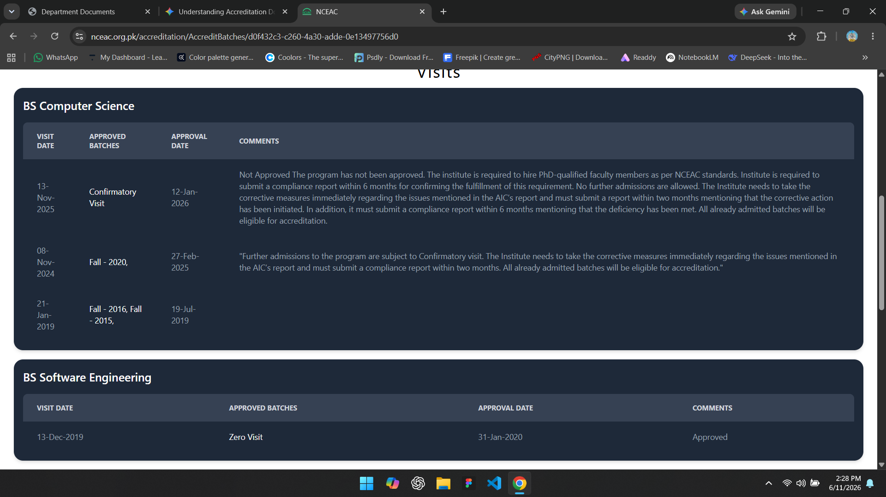
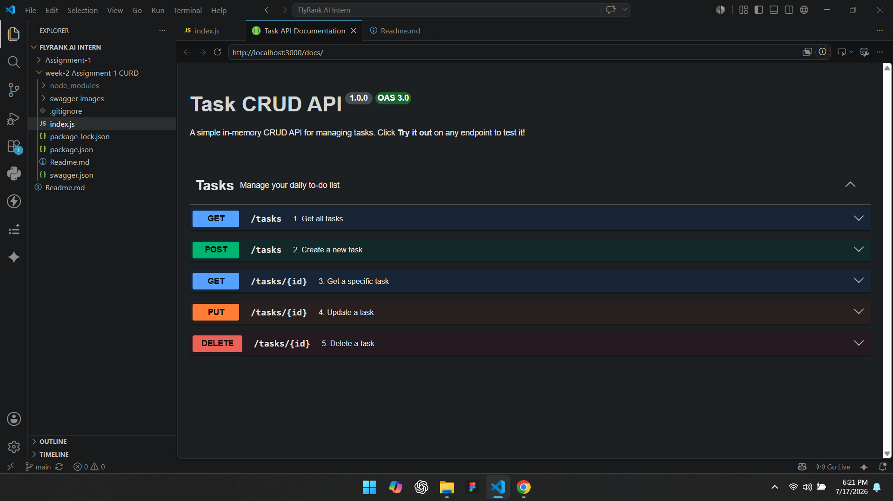
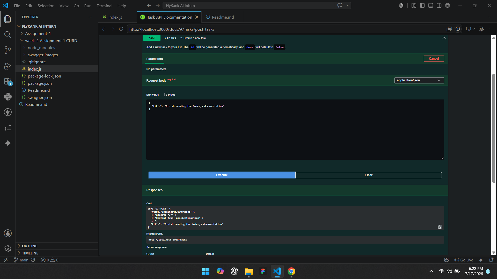
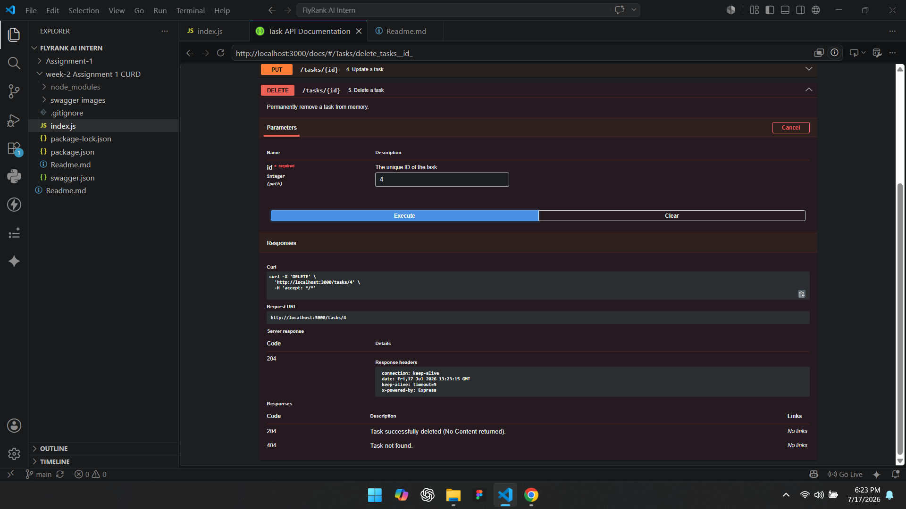
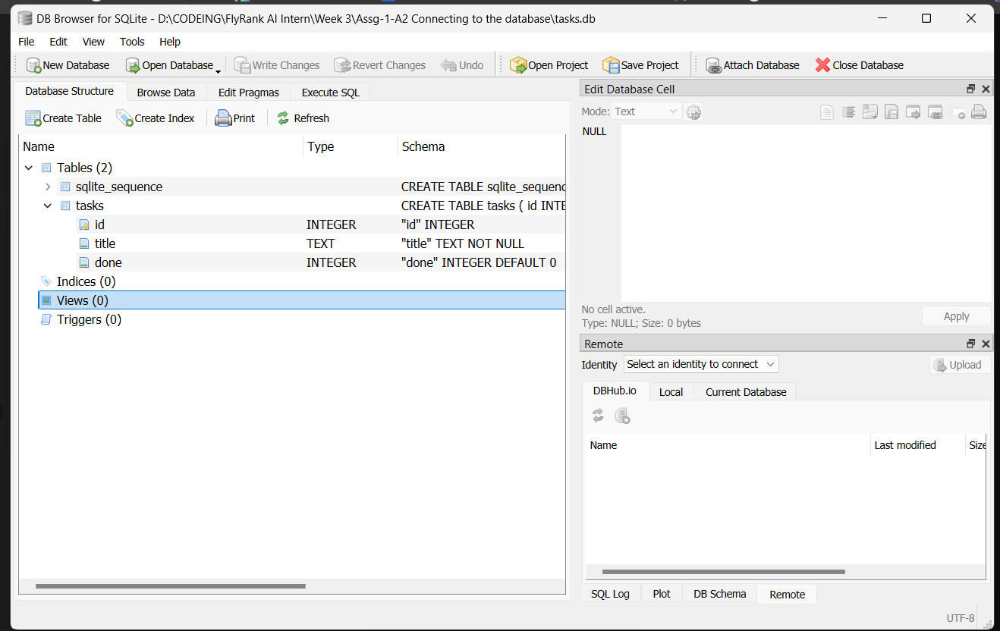
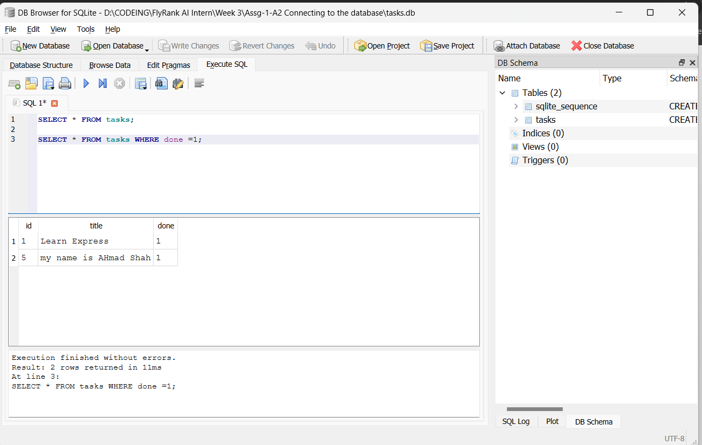
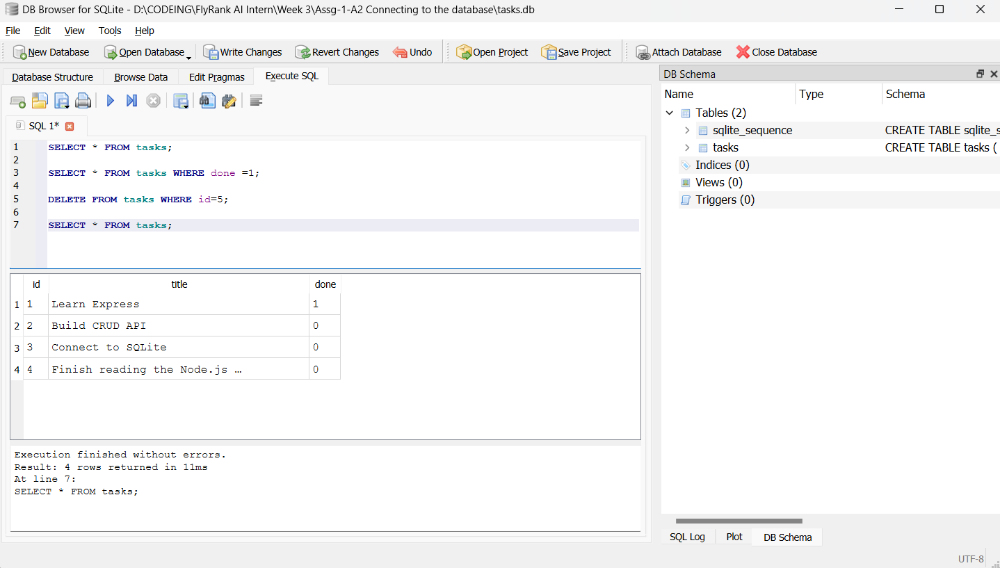
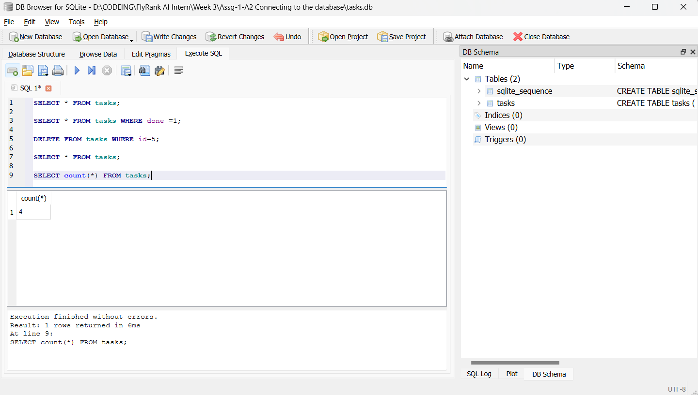

# Task API - Database Edition

A RESTful API built with Node.js and Express that manages a daily to-do list. In this iteration (Week 3), the volatile in-memory storage has been replaced with a persistent SQLite database.

## Architecture & Storage

* **Why SQLite was chosen:** For this assignment, we utilized Node 22's built-in `node:sqlite` module. SQLite is lightweight, requires no separate background server to run, and bypassing `better-sqlite3` meant we did not need to install heavy C++ build tools (like Visual Studio Build Tools) to compile the database engine.
* **Where the database file is stored:** The data is stored locally in a single file named `tasks.db` located at the root of the project directory. (Note: This file is ignored via `.gitignore` and is not pushed to the repository).

## Getting Started

Follow these steps to run the API on your local machine. The database and tables will be generated automatically on the first run.

### Prerequisites
* [Node.js](https://nodejs.org/) (v22.5.0 or higher required for native SQLite support).

### Installation & Run Command
Run the following commands in your terminal to start the server:

```bash
# Install dependencies
npm install

# Start the server
node index.js
```

*The server will start on `http://localhost:3000`.*

## Interactive Documentation
You can view and interact with the full API documentation directly in your browser using Swagger UI.
Once the server is running, visit:
👉 http://localhost:3000/docs

Example SQL Query
As part of the database exploration, here is an example of a raw SQL query executed against the database using DB Browser for SQLite:

Query: Mark all tasks as completed.
UPDATE tasks SET done = 1;


## Endpoints

| CRUD Operation | HTTP Method | Endpoint | Description |
| :--- | :--- | :--- | :--- |
| **Read (All)** | `GET` | `/tasks` | Retrieves an array of all tasks. |
| **Read (Single)**| `GET` | `/tasks/:id` | Retrieves a specific task by its ID. |
| **Create** | `POST` | `/tasks` | Creates a new task. Requires a JSON body with a `title`. |
| **Update** | `PUT` | `/tasks/:id` | Updates an existing task's `title` or `done` status. |
| **Delete** | `DELETE` | `/tasks/:id` | Deletes a task by its ID. |
| **Health Check** | `GET` | `/health` | Returns server health status. |


## Screenshots










# Author: Syed Ahmad Shah